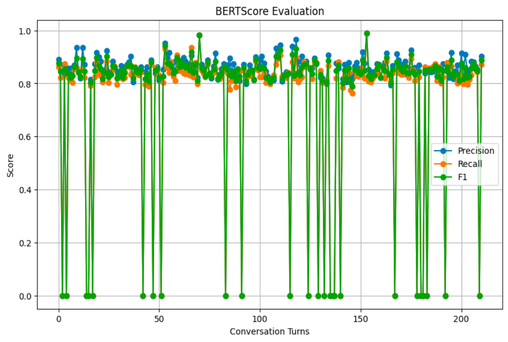

#### Model
The models used in this code is the `unsloth/llama-2-7b` model, which is accessed through Hugging Face's `transformers` library.

#### Prompt Input
The input to the model consists of conversational prompts formatted with a system prompt. Each conversation turn is processed where:
- The human input is prefixed with "Human: ".
- The formatted prompt includes both the system prompt and the human input.

Example:
```
Human: Good morning, sir. Is there a bank near here?
System Prompt: You are a conversation AI assistant named Jack that helps other humans in developing their conversational skills. You are friendly and truthful and keep the conversation candid. Give only a SINGLE response to the human input.
```

#### Output
The output is the model's generated response to each input prompt. The response is formatted to include the model's persona as "Jack" and is expected to be a single, coherent response to the human input.

Example:
```
Output: Yes, there is a bank near here.
```

#### Ground Truth
The ground truth, or reference, is the actual response from the dataset that the model is expected to generate. In this context, the reference responses are extracted from the DailyDialog dataset, which contains human conversational dialogues.

Example:
```
Reference: There is one . 5 blocks away from here.
```

#### BERT Score
BERTScore is a metric used to evaluate the quality of text generation models. It leverages pre-trained BERT embeddings to compute similarity scores between the predicted text (output) and the reference text (ground truth).

**Explanation of BERT Score:**
- **Precision**: Measures how many of the predicted tokens are relevant and found in the reference.
- **Recall**: Measures how many of the reference tokens are correctly predicted by the model.
- **F1 Score**: The harmonic mean of Precision and Recall, providing a balanced measure of both aspects.

In this code, the BERTScore is computed using the `evaluate` library, which compares the model's predictions against the references and provides the precision, recall, and F1 scores for a comprehensive evaluation of the model's performance.

### Model scores

| Model | Average precision | Average F1 score | Average recall |
|-|-|-|-|
| Llama 2 | 0.83 | 0.83 | 0.83 |
| Unsloth Llama 2 | 0.52 | 0.52 | 0.51 |
| Unsloth Mistral | 0.80 | 0.79| 0.78 |
| Unsloth Gemma  | 0.77 | 0.76 | 0.76|
### Code Snippet:
```python
from evaluate import load

# Compute BERTScore
bertscore = load("bertscore")
results = bertscore.compute(predictions=prediction, references=reference, lang="en")

# Print BERTScore results
print(f"Precision: {results['precision']}")
print(f"Recall: {results['recall']}")
print(f"F1 Score: {results['f1']}")
```

### BERT Score Results
- **Average Precision**: 0.77
- **Average Recall**: 0.75
- **Average F1 Score**: 0.76



### End-to-End Pipeline 

1. **Install Necessary Libraries and Dependencies**
   ```python
   !pip install -U "xformers<0.0.26" --index-url https://download.pytorch.org/whl/cu121
   !pip install "unsloth[kaggle-new] @ git+https://github.com/unslothai/unsloth.git"
   !pip install evaluate
   !pip install bert_score
   !pip install datasets==2.16.0 fsspec==2023.10.0 gcsfs==2023.10.0
   !pip install transformers
   ```

2. **Load and Initialize Model and Tokenizer**
   ```python
   from unsloth import FastLanguageModel
   import torch

   # Configuration
   max_seq_length = 2048
   dtype = None  # None for auto detection. Float16 for Tesla T4, V100, Bfloat16 for Ampere+
   load_in_4bit = True # Use 4bit quantization to reduce memory usage.

   # Initialize the model and tokenizer
   model_name = "unsloth/mistral-7b-bnb-4bit"
   model, tokenizer = FastLanguageModel.from_pretrained(
       model_name=model_name,
       max_seq_length=max_seq_length,
       dtype=dtype,
       load_in_4bit=load_in_4bit
   )
   ```

3. **Load Dataset**
   ```python
   import pandas as pd
   from datasets import load_dataset

   # Load the DailyDialog dataset
   dataset = load_dataset("daily_dialog")
   eval_dataset = load_dataset("daily_dialog", split="validation")

   # Extract dialogs
   eval_dialogs = eval_dataset['dialog']
   eval_dialog_dataset = pd.DataFrame({'conversation': eval_dialogs})
   print(eval_dialog_dataset.head())
   ```

4. **Set Up Generation Configuration**
   ```python
   from transformers import GenerationConfig, LlamaForCausalLM, LlamaTokenizer

   # Set up generation configuration
   generation_config = GenerationConfig.from_pretrained("unsloth/mistral-7b-bnb-4bit")
   ```

5. **Create Text Generation Pipeline**
   ```python
   from transformers import pipeline

   # Create a pipeline for text generation
   pipe = pipeline("text-generation", model=model, tokenizer=tokenizer)
   ```

6. **Define Helper Functions**
   ```python
   def format_prompt(prompt: str, system_prompt: str) -> str:
       return f"""
   {system_prompt}
   {prompt}
   """.strip()

   def generate_response(prompt: str, max_new_tokens: int = 128) -> str:
       response = pipe(prompt, max_new_tokens=max_new_tokens)
       return response[0]['generated_text']

   def parse_output(output_string):
       # Split the output string by newline characters
       lines = output_string.split('\n')
       
       # Iterate through the lines to find the first answer from Jack
       for line in lines:
           if line.startswith("Jack:"):
               # Extract the answer by removing "Jack:" and any leading/trailing whitespace
               answer = line.replace("Jack:", "").strip()
               return answer

   def checking_prediction(prediction):
       prediction = ["" if output is None else output for output in prediction]
       return prediction
   ```

7. **Generate Responses and Collect Predictions and References**
   ```python
   SYSTEM_PROMPT = """
   You are a conversation AI assistant named Jack that helps other humans in developing their conversational skills. You are friendly and truthful and keep the conversation candid. Give only a SINGLE response to the human input.
   """.strip()

   prediction = []
   reference = []
   conversations = []

   for j in range(50):
       temp_pred = []
       temp_ref = []
       convo = eval_dataset[j]['dialog']
       conversations.append(convo)
       if len(convo) % 2 != 0:
           convo.pop()
       for i in range(len(convo)):
           if i % 2 == 0:
               # Format the human input into the prompt
               prompt = f"Human: {convo[i]}"
               response = generate_response(format_prompt(prompt, SYSTEM_PROMPT), max_new_tokens=50)
               if response is None:
                   response = ""
               temp_pred.append(parse_output(response))
           else:
               temp_ref.append(convo[i])
       temp_pred = checking_prediction(temp_pred)
       prediction.append(temp_pred)
       reference.append(temp_ref)
   ```

8. **Evaluate Using BERTScore**
   ```python
   from evaluate import load

   # Compute BERTScore
   bertscore = load("bertscore")
   results = bertscore.compute(predictions=[pred for preds in prediction for pred in preds], references=[ref for refs in reference for ref in refs], lang="en")

   # Print BERTScore results
   print(f"Precision: {results['precision']}")
   print(f"Recall: {results['recall']}")
   print(f"F1 Score: {results['f1']}")
   ```

9. **Save Predictions and References to Text Files**
   ```python
   # Save predictions and references to separate text files with conversation turns
   with open('predictions.txt', 'w') as f_pred, open('references.txt', 'w') as f_ref:
       for idx, convo in enumerate(conversations):
           f_pred.write(f"Conversation {idx+1}:\n")
           f_ref.write(f"Conversation {idx+1}:\n")
           for i in range(len(prediction[idx])):
               f_pred.write(f"Human: {convo[i*2]}\n")
               f_pred.write(f"Output: {prediction[idx][i]}\n")
               f_ref.write(f"Human: {convo[i*2]}\n")
               f_ref.write(f"Reference: {reference[idx][i]}\n")
           f_pred.write("\n")
           f_ref.write("\n")

   # Provide download links for the files
   from IPython.display import FileLink, display
   display(FileLink(r'predictions.txt'))
   display(FileLink(r'references.txt'))
   ```

### Predictions and References
The `predictions.txt` file contains the model's generated responses for each conversation, while the `references.txt` file contains the actual responses from the dataset. Below are examples from each file for a single conversation:

**Example from `predictions.txt`**:
```
Conversation 1:
Human: Good morning, sir. Is there a bank near here?
Output: Yes, there is a bank near here.
Human: Well, that's too far. Can you change some money for me?
Output: Sure, I can change some money for you.
Human: RIB.
Output: I don't understand.
```

**Example from `references.txt`**:
```
Conversation 1:
Human: Good morning, sir. Is there a bank near here?
Reference: There is one . 5 blocks away from here?
Human: Well, that's too far. Can you change some money for me?
Reference: Surely, of course. What kind of currency have you got?
Human: RIB.
Reference: How much would you like to change?
```


